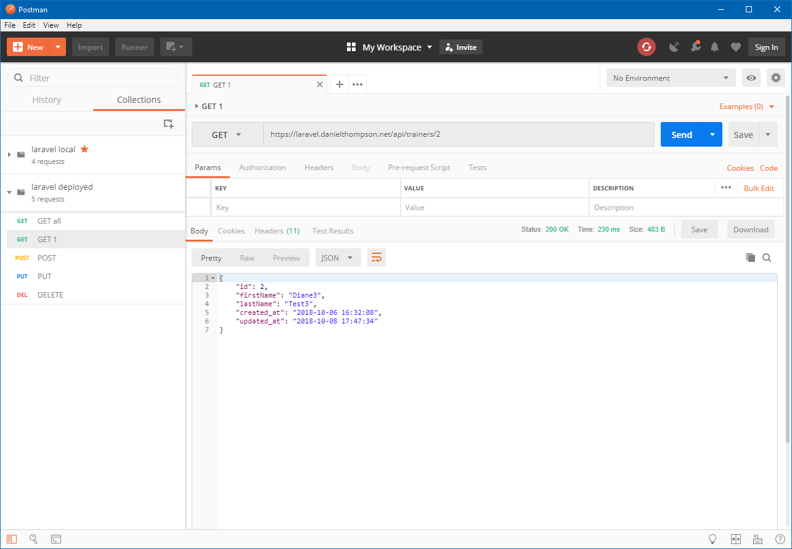
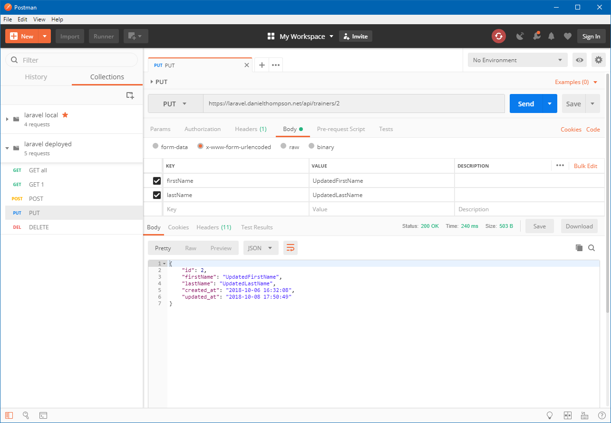
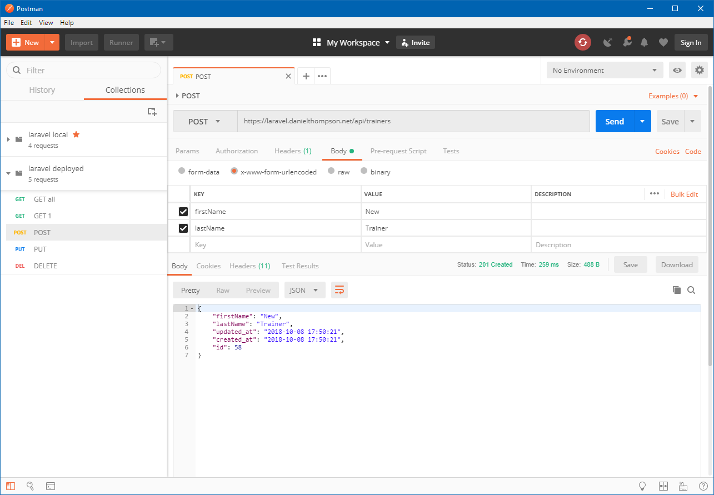

# laravel-spike

This is a quick demonstration of Laravel's ability to implement RESTful web services. 

See the CI process and unit tests at [Travis CI](https://travis-ci.org/danielthompson/laravel-spike).

Point your favorite client at [the API](https://laravel.danielthompson.net/api/trainers). I recommend [Postman](https://www.getpostman.com/).

The following verbs are supported: 

`GET`

`PUT` 

`POST`

`DELETE`

